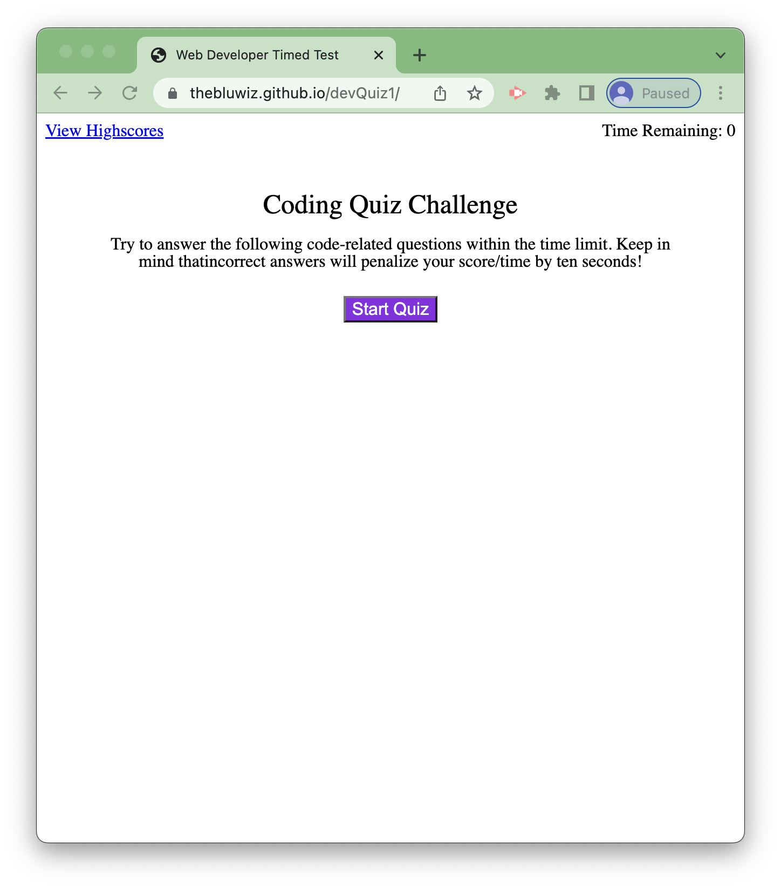

# Developer Code Quiz
## Description
This code quiz is designed to allow developers compare knowledge while proceeding through a class or bootcamp. You are given 90 seconds to answer as many questions as you can, and time is subtracted if you answer questions incorrectly. Your final score will be saved persistently after the timer ends. This encourages the quiz taker to be thoughtful with their answers rather than rush through.

## Tasks
- Built arrays of objects to store questions, potential answers and the correct answer.
- Created state variables to keep track of the users progress during the test.
- Dynamically updates the UI based on users progress with event listeners and functions.
- Allows score persistance through page refreshes.

## Moving Forward
I may add additional questions or even levels of the test now that the sorting algorithms have been built. It might be a good venture to only allow test takers to move on to the next level once they have answered all of the questions correctly.  Additionally I may update the CSS to make the site more visually appealing. The site is already responsive since it utilizes flexbox, but it may benefit from additional break points and potentially  images to fill white space on larger screens.

## Example

## Deployed Site
You can take the quiz [here](https://thebluwiz.github.io/devQuiz1/   ). 

## Acknowledgements
The reset.css file was included from meyerweb.com. 
I also utilized a variant of the Fischer-Yates shuffle to sort my javascript.